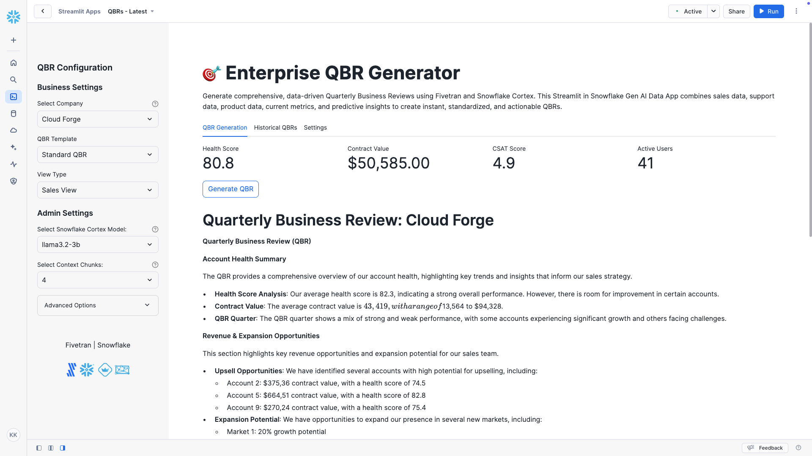
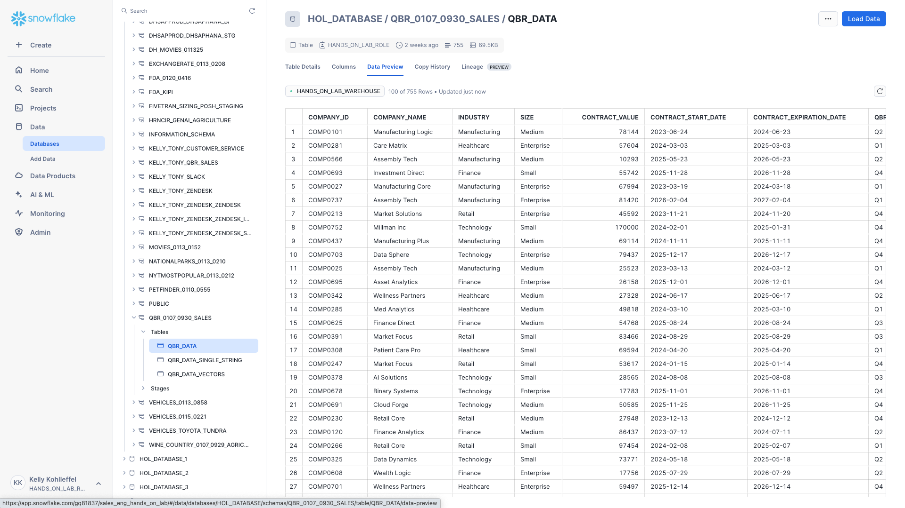
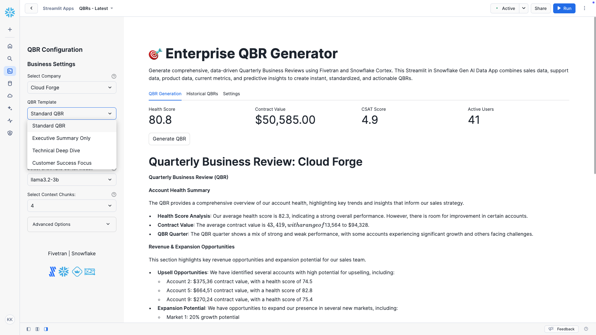

# QBR Data Generator and Enterprise QBR Generator

This project generates synthetic data for use in a QBR (Quarterly Business Review) generation application. The data generator simulates a combined dataset from a CRM (e.g. SFDC, Hubspot, D365), an issue and project tracking solution like Jira, and a customer service and support platform such as Zendesk. The generated data includes:
- 750 randomly generated records with industry-specific company names
- 5 control records for testing
- Data representing integration from multiple systems and MEDDICC sales qualification

In addition, the second part of this project addresses two critical sales challenges that are organization-wide in every company:
1. Creating reliable, standardized quarterly business review presentations for sales management
2. Reducing (or potentially eliminating) the time account executives spend preparing QBRs



## Project Setup

### Initial Setup with GitHub Desktop
1. Open GitHub Desktop
2. Click "File" > "New Repository"
3. Fill in:
   - Name: `qbr-data-generator`
   - Add a description (optional)
   - Choose your local path
   - Initialize with a README
   - Click "Create Repository"
4. Click "Open in Visual Studio Code"

### Directory Structure in VS Code
Create the following structure:
```plaintext
qbr-data-generator/
├── files/
│   ├── streamlit-code.py
│   └── transformations.sql
├── images/
├── output/
├── src/
│   ├── __init__.py
│   └── data_generator.py
├── venv/
├── .gitattributes
├── .gitignore
├── README.md
└── requirements.txt
```

Create directories and files using terminal commands:
```bash
mkdir src output
touch src/__init__.py
touch src/data_generator.py
touch requirements.txt
```

### Virtual Environment Setup
In VS Code's terminal:
```bash
# Create virtual environment
python3 -m venv venv

# Activate virtual environment (Mac/Linux)
source venv/bin/activate
# OR for Windows
# .\venv\Scripts\activate

# Install required packages
pip install pandas numpy

# Save requirements
pip freeze > requirements.txt
```

### Create .gitignore
Create a new file called `.gitignore` and add:
```plaintext
venv/
__pycache__/
*.pyc
output/*.csv
.DS_Store
```

Then run:
```bash
git rm -r --cached .
git add .
git commit -m "Remove files that should be ignored"
```

## Data Sources & Fields

### Company Information (SFDC, Hubspot, Dynamics 365)
* company_id (Primary Key, format: 'COMPxxxx')
* company_name (Industry-specific naming convention)
* industry (Technology, Healthcare, Finance, Manufacturing, Retail)
* size (Small, Medium, Enterprise)
* contract_value
* contract_start_date
* contract_expiration_date

### Deal/Financial Data (SFDC, Hubspot, Dynamics 365)
* deal_stage (Implementation, Live, At Risk, Stable)
* renewal_probability
* upsell_opportunity
* qbr_quarter (Based on Fiscal Year: Feb 1 - Jan 31)
* qbr_year

### Product Usage Data (Jira)
* active_users
* feature_adoption_rate
* custom_integrations
* pending_feature_requests

### Support Data (Zendesk)
* ticket_volume
* avg_resolution_time_hours
* csat_score
* sla_compliance_rate

### MEDDICC Fields

#### Metrics
* success_metrics_defined (boolean)
* roi_calculated (boolean)
* estimated_roi_value (numeric)

#### Economic Buyer
* economic_buyer_identified (boolean)
* executive_sponsor_engaged (boolean)
* decision_maker_level (C-Level, VP, Director, Manager)

#### Decision Process
* decision_process_documented (boolean)
* next_steps_defined (boolean)
* decision_timeline_clear (boolean)

#### Decision Criteria
* technical_criteria_met (boolean)
* business_criteria_met (boolean)
* success_criteria_defined (text)

#### Identified Pain
* pain_points_documented (text)
* pain_impact_level (High, Medium, Low)
* urgency_level (High, Medium, Low)

#### Champion
* champion_identified (boolean)
* champion_level (C-Level, VP, Director, Manager)
* champion_engagement_score (1-5)

#### Competition
* competitive_situation (Single, Multiple, None)
* competitive_position (Leader, Strong, Weak)

### Calculated Metrics
* health_score (Weighted calculation based on key metrics)

## Control Records
The dataset includes 5 specific control records:
1. Kohlleffel Inc
2. Hrncir Inc
3. Millman Inc
4. Tony Kelly Inc
5. Kai Lee Inc

All control records have:
- Technology industry
- Small company size
- Specific contract values
- Q4 2024 QBR period
- Contract expiration date of 2025-01-31
- All other fields randomly generated

## Running the Generator

Generate sample data:
```bash
python3 src/data_generator.py
```

The generated CSV file will be saved in the `output` directory at:
```plaintext
~/Documents/GitHub/qbr-data-generator/output/qbr_sample_data.csv
```

## Dependencies

### Core Dependencies
```plaintext
pandas==2.1.0
numpy==1.24.3
```

## Notes
- The project uses a fiscal year that begins February 1 and ends January 31
- Company names are generated based on industry for more realistic data
- Health score is calculated using weighted metrics from various sources
- Generated data includes a mix of boolean, numeric, and categorical fields
- All metric ranges are set to realistic values based on typical business scenarios

## Support
For issues or questions, please open an issue in the GitHub repository.

## QBR Data Generator in action

### QBR Data Generator: csv output file


## Next Steps
1. Import the `qbr_sample_data.csv` as a new table named `qbr_data` into your database of choice (I used PostgreSQL and created a new schema called `sales`).
2. Using Fivetran Automated Data Movement, connect to PostgreSQL and sync the new table to your destination of choice (I used Snowflake in this example).
3. Once the data is synced to Snowflake, open a new worksheet in Snowflake Snowsight and run the transformations as described below (be sure and set your database and schema context in the worksheet).

### Data Preview in Snowflake Snowsight


## Transformations in Snowflake for the QBR Generator

### Transformation 1
The `QBR_DATA_SINGLE_STRING` transformation consolidates multiple QBR fields into a single text string per account, which is crucial for embedding model processing. LLM embedding models are designed to process natural language content as a unified text block rather than separate fields. 

This consolidation, with descriptive prefixes for each field, ensures the embedding model can effectively capture semantic relationships across all QBR data points while maintaining context.

### Transformation 2
The `qbr_data_vectors` transformation creates a vector table using Snowflake's Cortex embed_text_768 is a fundamental component for implementing RAG (Retrieval Augmented Generation) with LLMs. 

These embeddings allow for semantic similarity searches, enabling the system to efficiently retrieve the most relevant QBR contexts when generating responses. In a RAG workflow, these vectors serve as the search index that helps identify and retrieve the most pertinent company information before it's fed into the LLM prompt.

### Sample Query
The sample query serves as a verification step to inspect both the consolidated text format and its corresponding vector embeddings. This validation is important because it confirms that both the text concatenation maintained field context and the embedding process generated the expected vector dimensions.

```sql
/** Transformation #1 - Create the qbr_data_single_string table and the qbr_information column using concat and prefixes for columns (creates an "unstructured" doc for each account)
/** Create each qbr review as a single string vs multiple fields **/
CREATE OR REPLACE TABLE QBR_DATA_SINGLE_STRING AS 
    SELECT company_name, CONCAT(
        'The company name is ', IFNULL(company_name, 'unknown'), '.',
        ' The company ID is ', IFNULL(company_id, 'unknown'), '.',
        ' This is a ', IFNULL(size, 'unknown'), ' ', IFNULL(industry, 'unknown'), ' company.',
        ' The contract started on ', IFNULL(contract_start_date, 'unknown'), ' and expires on ', IFNULL(contract_expiration_date, 'unknown'), '.',
        ' The annual contract value is $', IFNULL(contract_value::STRING, 'unknown'), '.',
        ' The current deal stage is ', IFNULL(deal_stage, 'unknown'), '.',
        ' The renewal probability is ', IFNULL(renewal_probability::STRING, 'unknown'), '%.',
        ' The identified upsell opportunity is $', IFNULL(upsell_opportunity::STRING, 'unknown'), '.',
        ' The number of active users is ', IFNULL(active_users::STRING, 'unknown'), '.',
        ' The feature adoption rate is ', IFNULL(ROUND(feature_adoption_rate * 100, 1)::STRING, 'unknown'), '%.',
        ' The number of custom integrations is ', IFNULL(custom_integrations::STRING, 'unknown'), '.',
        ' The number of pending feature requests is ', IFNULL(pending_feature_requests::STRING, 'unknown'), '.',
        ' The number of support tickets is ', IFNULL(ticket_volume::STRING, 'unknown'), '.',
        ' The average resolution time is ', IFNULL(avg_resolution_time_hours::STRING, 'unknown'), ' hours.',
        ' The CSAT score is ', IFNULL(csat_score::STRING, 'unknown'), ' out of 5.',
        ' The SLA compliance rate is ', IFNULL(ROUND(sla_compliance_rate * 100, 1)::STRING, 'unknown'), '%.',
        ' Success metrics defined: ', IFNULL(success_metrics_defined::STRING, 'unknown'), '.',
        ' ROI calculated: ', IFNULL(roi_calculated::STRING, 'unknown'), '.',
        ' Estimated ROI value: $', IFNULL(estimated_roi_value::STRING, 'unknown'), '.',
        ' Economic buyer identified: ', IFNULL(economic_buyer_identified::STRING, 'unknown'), '.',
        ' Executive sponsor engaged: ', IFNULL(executive_sponsor_engaged::STRING, 'unknown'), '.',
        ' The decision maker level is ', IFNULL(decision_maker_level, 'unknown'), '.',
        ' Decision process documented: ', IFNULL(decision_process_documented::STRING, 'unknown'), '.',
        ' Next steps defined: ', IFNULL(next_steps_defined::STRING, 'unknown'), '.',
        ' Decision timeline clear: ', IFNULL(decision_timeline_clear::STRING, 'unknown'), '.',
        ' Technical criteria met: ', IFNULL(technical_criteria_met::STRING, 'unknown'), '.',
        ' Business criteria met: ', IFNULL(business_criteria_met::STRING, 'unknown'), '.',
        ' The success criteria is defined as ', IFNULL(success_criteria_defined, 'unknown'), '.',
        ' The documented pain points are ', IFNULL(pain_points_documented, 'unknown'), '.',
        ' The pain impact level is ', IFNULL(pain_impact_level, 'unknown'), '.',
        ' The urgency level is ', IFNULL(urgency_level, 'unknown'), '.',
        ' Champion identified: ', IFNULL(champion_identified::STRING, 'unknown'), '.',
        ' The champion level is ', IFNULL(champion_level, 'unknown'), '.',
        ' The champion engagement score is ', IFNULL(champion_engagement_score::STRING, 'unknown'), ' out of 5.',
        ' The competitive situation is ', IFNULL(competitive_situation, 'unknown'), '.',
        ' Our competitive position is ', IFNULL(competitive_position, 'unknown'), '.',
        ' The overall health score is ', IFNULL(health_score::STRING, 'unknown'), '.',
        ' This QBR covers ', IFNULL(qbr_quarter, 'unknown'), ' ', IFNULL(qbr_year::STRING, 'unknown'), '.'
    ) AS qbr_information
    FROM QBR_DATA;

/** Transformation #2 - Using the Snowflake Cortex embed_text_768 LLM function, creates embeddings from the newly created qbr_information column and create a vector table called qbr_embeddings.
/** Create the vector table from the qbr_information column **/
      CREATE or REPLACE TABLE qbr_data_vectors AS 
            SELECT company_name, qbr_information, 
            snowflake.cortex.EMBED_TEXT_768('e5-base-v2', qbr_information) as QBR_EMBEDDINGS 
            FROM qbr_data_single_string;

/** Select a control record to see the LLM-friendly "text" document table and the embeddings table **/
    SELECT *
    FROM qbr_data_vectors
    WHERE qbr_information LIKE '%company_name is Kohlleffel Inc%';
```

### Output of Completed Data Transformations


## Streamlit in Snowflake QBR Generator Application

This Streamlit application transforms the traditional QBR process by automating the generation of standardized, data-driven business reviews using Snowflake's native LLM capabilities. The app addresses **two critical challenges in sales organizations**: 
1. Creating consistent, reliable QBR presentations for management
2. Eliminating the time-intensive QBR preparation process for account executives.

This app combines real-time metrics, historical data, and AI-powered analysis to generate comprehensive QBRs through an intuitive interface. Users can customize outputs through multiple templates (Executive, Technical, Customer Success, Sales) while maintaining standardization across the organization. 

It also leverages vector similarity search for contextual relevance and provides structured outputs covering executive summaries, business impact, product adoption, and strategic recommendations - all without requiring manual data compilation or presentation creation from the sales team.

## Usage
1. From within Snowflake Snowflake, go to Projects, select Streamlit, and create a new Streamlit app. Be sure and set the database and schema context when naming the new Streamlit app.
2. Copy and paste the code block below into the Streamlit editor and click `Run`.

```python
#
# Fivetran Snowflake Cortex Streamlit Lab
# Build a QBR Generator Application
#

import streamlit as st
from snowflake.snowpark.context import get_active_session
import pandas as pd
import time

# Configuration Constants
MODELS = [
    "llama3.2-3b", "claude-3-5-sonnet", "mistral-large2", "llama3.1-8b", "llama3.1-405b",
    "llama3.1-70b", "mistral-7b", "jamba-1.5-large", "mixtral-8x7b", "reka-flash", "gemma-7b"
]

CHUNK_NUMBER = [4,6,8,10,12,14,16]

QBR_TEMPLATES = ["Standard QBR", "Executive Summary Only", "Technical Deep Dive", "Customer Success Focus"]
VIEW_TYPES = ["Sales View", "Executive View", "Technical View", "Customer Success View"]

CONTEXT_CHUNKS = [4, 6, 8, 10, 12]

# Initialize Snowflake session
try:
    session = get_active_session()
except:
    st.error("Could not get active Snowflake session. Please check your connection.")
    st.stop()

def build_prompt(company_data, similar_contexts, template_type, view_type):
    """Builds a prompt with RAG context using template modifications and view-specific emphasis."""

    template_instructions = {
        "Standard QBR": """
        This is a full Quarterly Business Review (QBR) covering all key aspects, including health score analysis, adoption metrics, customer satisfaction, and strategic recommendations.
        """,
        "Executive Summary Only": """
        This QBR should be concise and high-level, focusing only on key insights, major wins, critical challenges, and high-level recommendations.
        Exclude deep technical details, adoption trends, and granular product feature analysis.
        """,
        "Technical Deep Dive": """
        This QBR should focus on technical aspects such as system architecture, integrations, API usage, performance metrics, and technical challenges.
        Prioritize technical success metrics, potential optimizations, and engineering recommendations.
        Minimize business-level overviews and executive summaries.
        """,
        "Customer Success Focus": """
        This QBR should emphasize customer engagement, product adoption, support trends, and user satisfaction.
        Focus on training needs, adoption blockers, support ticket patterns, and customer success strategies.
        Minimize in-depth technical or executive-level details.
        """
    }

    view_type_instructions = {
        "Sales View": """
        This QBR should focus on revenue impact, upsell opportunities, contract value, expansion potential, and risk mitigation.
        Prioritize key financial metrics, deal health, and strategic recommendations for account growth.
        Minimize highly technical discussions unless relevant for deal positioning.
        """,
        "Executive View": """
        This QBR should provide a high-level strategic overview, emphasizing business outcomes, financial impact, and alignment with company goals.
        Keep details concise, use bullet points, and focus on key wins, challenges, and high-level recommendations.
        Minimize operational or highly technical details.
        """,
        "Technical View": """
        This QBR should provide a deep dive into system performance, architecture, integrations, and product adoption from a technical perspective.
        Prioritize API usage, reliability metrics, infrastructure considerations, and upcoming technical improvements.
        Minimize business-oriented insights unless relevant to product engineering.
        """,
        "Customer Success View": """
        This QBR should focus on customer satisfaction, adoption trends, support tickets, training needs, and customer engagement.
        Prioritize recommendations for improving retention, reducing churn, and addressing adoption blockers.
        Minimize purely financial or highly technical content unless relevant for success strategy.
        """
    }

    view_based_sections = {
        "Sales View": """
        1. Account Health Summary  
        2. Revenue & Expansion Opportunities  
        3. Usage Trends & Adoption Insights  
        4. Competitive Positioning  
        5. Strategic Sales Recommendations  
        """,
        "Executive View": """
        1. Key Business Outcomes  
        2. ROI & Financial Impact  
        3. Adoption & Customer Engagement  
        4. Strategic Roadmap Alignment  
        5. High-Level Recommendations  
        """,
        "Technical View": """
        1. System Performance & API Usage  
        2. Infrastructure & Security Considerations  
        3. Feature Adoption & Implementation Status  
        4. Engineering Challenges & Optimization Strategies  
        5. Technical Roadmap & Upcoming Enhancements  
        """,
        "Customer Success View": """
        1. Customer Engagement & Satisfaction Metrics  
        2. Product Adoption & User Retention  
        3. Support Trends & Resolution Efficiency  
        4. Training & Enablement Opportunities  
        5. Customer Success Strategy & Next Steps  
        """
    }

    qbr_type_instructions = template_instructions.get(template_type, "")
    view_specific_instructions = view_type_instructions.get(view_type, "")
    dynamic_sections = view_based_sections.get(view_type, "1. Executive Summary\n2. Business Impact\n3. Strategic Recommendations")

    prompt = f"""
    You are an expert business analyst creating a Quarterly Business Review (QBR). 
    Generate a {template_type} QBR using the following data and format:

    {qbr_type_instructions}

    {view_specific_instructions}

    Company Data:
    {company_data}

    Historical Context:
    {similar_contexts if similar_contexts else 'No historical context available'}

    Structure the QBR based on {view_type}, prioritizing the most relevant insights.
    
    Use the following section structure:
    {dynamic_sections}

    Format the QBR professionally with clear section headers and bullet points for key insights.
    Prioritize the most relevant information for {view_type} and {template_type}.
    """

    return prompt

def get_company_data(company_name):
    """Retrieve company data from Snowflake."""
    try:
        metrics_query = """
        SELECT 
            HEALTH_SCORE, 
            CONTRACT_VALUE, 
            CSAT_SCORE, 
            ACTIVE_USERS,
            FEATURE_ADOPTION_RATE,
            TICKET_VOLUME,
            RENEWAL_PROBABILITY,
            QBR_QUARTER,
            QBR_YEAR
        FROM QBR_DATA
        WHERE COMPANY_NAME = ?
        """
        return session.sql(metrics_query, params=[company_name]).to_pandas()
    except Exception as e:
        st.error(f"Error retrieving company data: {str(e)}")
        return None

def generate_qbr_content(company_data, similar_contexts, template_type, view_type, selected_model):
    """Generate QBR content using Snowflake Cortex."""
    try:
        prompt = build_prompt(company_data, similar_contexts, template_type, view_type)
        cortex_query = """
        SELECT SNOWFLAKE.CORTEX.COMPLETE(
            ?,
            ?
        ) as response
        """
        response = session.sql(cortex_query, params=[selected_model, prompt]).collect()[0][0]
        return response
    except Exception as e:
        st.error(f"Error generating QBR content: {str(e)}")
        return None

def display_metrics_dashboard(metrics_df):
    """Display key metrics dashboard"""
    col1, col2, col3, col4 = st.columns(4)
    
    with col1:
        st.metric(
            "Health Score", 
            f"{metrics_df['HEALTH_SCORE'].iloc[0]:.1f}",
            delta=None
        )
    
    with col2:
        st.metric(
            "Contract Value", 
            f"${metrics_df['CONTRACT_VALUE'].iloc[0]:,.2f}",
            delta=None
        )
    
    with col3:
        st.metric(
            "CSAT Score", 
            f"{metrics_df['CSAT_SCORE'].iloc[0]:.1f}",
            delta=None
        )
    
    with col4:
        st.metric(
            "Active Users", 
            int(metrics_df['ACTIVE_USERS'].iloc[0]),
            delta=None
        )

import streamlit as st

def search_similar_companies(query, top_k=3, model="claude-3-5-sonnet"):
    """Search for similar companies with improved accuracy and formatting."""
    try:
        # Direct SQL approach for exact name matching - this will be more accurate for exact searches
        exact_match_query = """
        SELECT 
            COMPANY_NAME,
            QBR_INFORMATION
        FROM QBR_DATA_VECTORS
        WHERE LOWER(COMPANY_NAME) LIKE LOWER(?)
        LIMIT ?
        """
        
        # Try with wildcards for partial matching
        exact_results = session.sql(exact_match_query, params=[f"%{query}%", top_k]).to_pandas()
        
        # If no exact match, fall back to content search
        if exact_results.empty:
            content_query = """
            SELECT 
                COMPANY_NAME,
                QBR_INFORMATION
            FROM QBR_DATA_VECTORS
            WHERE CONTAINS(QBR_INFORMATION, ?)
            LIMIT ?
            """
            results = session.sql(content_query, params=[query, top_k]).to_pandas()
        else:
            results = exact_results
        
        if results.empty:
            # If still no results, use Cortex as a last resort
            search_prompt = f"""
            Based on the search query "{query}", search through a database of companies.
            Return information about companies that match this query.
            """
            
            cortex_query = """
            SELECT SNOWFLAKE.CORTEX.COMPLETE(
                ?,
                ?
            ) as response
            """
            
            response = session.sql(cortex_query, params=[model, search_prompt]).collect()[0][0]
            
            if not response:
                return None
                
            return response
        
        # Format the results with clean formatting
        formatted_results = []
        for _, row in results.iterrows():
            # Clean up the QBR information - replace any strange character sequences
            clean_info = row['QBR_INFORMATION']
            # Remove any strange sequences of single characters
            import re
            clean_info = re.sub(r'([A-Za-z])\s*\n\s*([A-Za-z])\s*\n\s*([A-Za-z])', r'\1\2\3', clean_info)
            clean_info = re.sub(r'\.([A-Za-z])', r'. \1', clean_info)  # Add space after periods
            
            formatted_results.append(f"**Company:** {row['COMPANY_NAME']}\n\n{clean_info}")
        
        return '\n\n---\n\n'.join(formatted_results)
        
    except Exception as e:
        st.error(f"Error during search: {str(e)}")
        return None

def main():
    st.set_page_config(layout="wide", page_title="Enterprise QBR Generator")
    
    # Initialize session state
    if 'qbr_history' not in st.session_state:
        st.session_state.qbr_history = []
    
    # Title and Description
    st.title("🎯 Enterprise QBR Generator")
    st.write("""
    Generate comprehensive, data-driven Quarterly Business Reviews using Fivetran and Snowflake Cortex. 
    This Streamlit in Snowflake Gen AI Data App combines sales data, support data, product data, 
    current metrics, and predictive insights to create instant, standardized, and actionable QBRs.
    """)

    # Sidebar Configuration
    with st.sidebar:
        st.header("QBR Configuration")
        
        # Business Settings
        st.subheader("Business Settings")
        
        # Company Selection
        company_query = """
        SELECT DISTINCT COMPANY_NAME
        FROM QBR_DATA
        ORDER BY COMPANY_NAME
        """
        companies_df = session.sql(company_query).to_pandas()
        selected_company = st.selectbox(
            "Select Company",
            options=[""] + companies_df['COMPANY_NAME'].tolist(),
            help="Type to search for a specific company"
        )
        
        # Template Selection
        template_type = st.selectbox(
            "QBR Template",
            QBR_TEMPLATES
        )
        
        view_type = st.selectbox(
            "View Type",
            VIEW_TYPES
        )
        
        # Admin Settings
        st.subheader("Admin Settings")
        
        # Model Selection
        selected_model = st.selectbox(
            "Select Snowflake Cortex Model:",
            MODELS,
            help="Choose the LLM model for QBR generation"
        )
        
        # Chunk Selection
        selected_chunks = st.selectbox(
            "Select Context Chunks:",
            CHUNK_NUMBER,
            help="Number of context chunks to include (200-400 tokens per chunk)"
        )
        
        # Advanced Options
        with st.expander("Advanced Options"):
            use_historical = st.checkbox(
                "Include Historical Context",
                help="Use similar QBRs for enhanced insights"
            )
            
            include_validation = st.checkbox(
                "Enable Data Validation",
                help="Add validation steps to the QBR process"
            )

        # Add spacing before branding text
        for _ in range(2):
            st.write("")

        # Branding Text (Above the logo)
        st.markdown(
            "<h4 style='text-align: center; font-weight: normal;'>Fivetran | Snowflake</h4>", 
            unsafe_allow_html=True
        )

        # Add spacing before logo
        for _ in range(1):
            st.write("")

        # Correct logo URL
        logo_url = "https://i.imgur.com/9lS8Y34.png"

        st.markdown(
            f"""
            <div style="display: flex; justify-content: center;">
                
            </div>
            """,
            unsafe_allow_html=True
        )
    
    # Main Content Area
    tabs = st.tabs(["QBR Generation", "Historical QBRs", "Settings"])
    
    with tabs[0]:
        if selected_company:
            # Get and display company metrics
            company_data = get_company_data(selected_company)
            if company_data is not None:
                display_metrics_dashboard(company_data)
                
                # QBR Generation Button
                if st.button("Generate QBR"):
                    with st.spinner("Generating QBR..."):
                        # Get similar contexts if enabled
                        similar_contexts = None
                        if use_historical:
                            similar_contexts = get_similar_contexts(
                                selected_company,
                                selected_chunks
                            )
                        
                        # Generate QBR content
                        qbr_content = generate_qbr_content(
                            company_data,
                            similar_contexts,
                            template_type,
                            view_type,
                            selected_model
                        )
                        
                        if qbr_content:
                            # Display generated QBR
                            st.header(f"Quarterly Business Review: {selected_company}")
                            st.write(qbr_content)
                            
                            # Add download button
                            st.download_button(
                                label="Download QBR",
                                data=qbr_content,
                                file_name=f"QBR_{selected_company}_{pd.Timestamp.now().strftime('%Y%m%d')}.md",
                                mime="text/markdown"
                            )
                            
                            # Save to history
                            st.session_state.qbr_history.append({
                                'company': selected_company,
                                'date': pd.Timestamp.now(),
                                'content': qbr_content,
                                'template': template_type,
                                'view_type': view_type
                            })
    
    with tabs[1]:
        if st.session_state.qbr_history:
            for qbr in reversed(st.session_state.qbr_history):
                with st.expander(f"{qbr['company']} - {qbr['date'].strftime('%Y-%m-%d %H:%M')}"):
                    st.write(qbr['content'])
        else:
            st.info("No QBR history available")
    
    with tabs[2]:
        st.write("QBR Generation Settings")
        
        st.subheader("Snowflake Settings")
        # Get current session information
        try:
            # Get the current context information
            context_query = "SELECT CURRENT_DATABASE(), CURRENT_SCHEMA()"
            context_result = session.sql(context_query).collect()
            current_db = context_result[0][0] if context_result else "Not available"
            current_schema = context_result[0][1] if context_result else "Not available"
            
            st.write(f"**Database:** {current_db}")
            st.write(f"**Schema:** {current_schema}")
            st.write(f"**Model:** {selected_model}")
        except Exception as e:
            st.error(f"Error retrieving Snowflake context: {str(e)}")
        
        # Add test search box
        st.subheader("Test Semantic Search")
        test_query = st.text_input("Enter a search query to test semantic search", 
                              placeholder="E.g., capital forge, factory focus, kohlleffel inc")
        if test_query and st.button("Search"):
            with st.spinner("Searching similar companies..."):
                similar_companies = search_similar_companies(test_query, top_k=3, model=selected_model)
                if similar_companies:
                    st.success(f"Found companies matching '{test_query}'")
                    companies_list = similar_companies.split('\n\n---\n\n')
                    
                    for i, company in enumerate(companies_list):
                        # Split company data into name and details
                        parts = company.split('\n\n', 1)
                        company_name = parts[0].replace('**Company:** ', '') if len(parts) > 0 else f"Result #{i+1}"
                        company_details = parts[1] if len(parts) > 1 else company
                        
                        # Clean up formatting issues
                        import re
                        company_details = re.sub(r'([a-z])([A-Z])', r'\1 \2', company_details)  # Add space between lowercase followed by uppercase
                        company_details = re.sub(r'\.([A-Z])', r'. \1', company_details)  # Add space after period followed by uppercase
                        
                        # Extract key metrics for better display
                        metrics = {}
                        # Try to extract commonly used metrics
                        for metric in ["health score", "contract value", "CSAT score", "active users"]:
                            pattern = rf"(?:the )?{metric}(?: is)? (\d+\.?\d*)"
                            match = re.search(pattern, company_details.lower())
                            if match:
                                metrics[metric.title()] = match.group(1)
                        
                        # Create an expander for each company
                        with st.expander(f"Company: {company_name}"):
                            # Show key metrics in columns if available
                            if metrics:
                                cols = st.columns(len(metrics))
                                for j, (metric, value) in enumerate(metrics.items()):
                                    with cols[j]:
                                        st.caption(metric)
                                        if "value" in metric.lower():
                                            st.markdown(f"**${value}**")
                                        else:
                                            st.markdown(f"**{value}**")
                            
                            # Display full company details with better formatting
                            st.caption("Company Details")
                            st.markdown(company_details)
                            
                            # Add a download button for each result with a unique key
                            st.download_button(
                                label="Download Details",
                                data=f"# {company_name}\n\n{company_details}",
                                file_name=f"{company_name.replace(' ', '_')}_details.md",
                                mime="text/markdown",
                                key=f"download_button_{i}_{company_name.replace(' ', '_')}"  # Add a unique key
                            )
                else:
                    st.warning("No similar companies found.")

if __name__ == "__main__":
    main()
```

## Enterprise QBR Generator in action

### Enterprise QBR Generator: Streamlit in Snowflake RAG-based, Gen AI Data App

